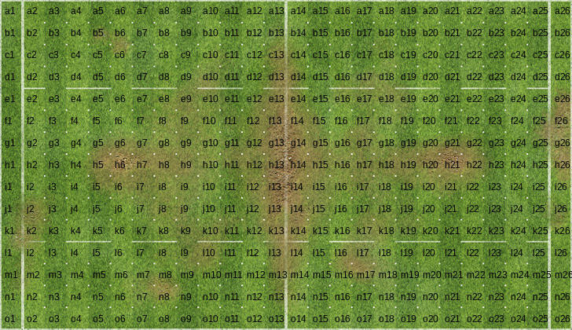

# About the fumbbl_replays Python package

The fumbbl_replays package is a Python utility package for the board game Blood Bowl. It allows users to fetch rosters, and plot board positions using graphical icons and digital loom bands.

https://gsverhoeven.github.io/post/fumbbl-replays/

# Installation on Linux

* Create a new Python virtual environment using `python3 -m venv fumbbl_replays_env`.
* Activate the environment using `source fumbbl_replays_env/bin/activate`.
* Install the `fumbbl_replays` package in this environment using `pip install git+https://github.com/gsverhoeven/fumbbl_replays.git`. It should automatically install the dependencies.
* Test the package: start python, then `import fumbbl_replays as fb; fb.fetch_roster("Chaos Dwarf")`

Expected output:

```
 positionId             positionName                                         skillArray shorthand                        icon_path         race
0      39326        Hobgoblin Lineman                                                 []         L  https://fumbbl.com/i/585631.png  Chaos Dwarf
1      39327      Chaos Dwarf Blocker               [Block, Thick Skull, Iron Hard Skin]         B  https://fumbbl.com/i/436257.png  Chaos Dwarf
2      39328     Bull Centaur Blitzer                   [Sprint, Sure Feet, Thick Skull]        BC  https://fumbbl.com/i/436258.png  Chaos Dwarf
3      39329                 Minotaur  [Frenzy, Horns, Loner (4+), Mighty Blow (+1), ...         M  https://fumbbl.com/i/436259.png  Chaos Dwarf
4      60338  Hobgoblin Sneaky Stabba                                  [Shadowing, Stab]         S  https://fumbbl.com/i/745751.png  Chaos Dwarf
5      60339   Chaos Dwarf Flamesmith  [Brawler, Breathe Fire, Disturbing Presence, T...         F  https://fumbbl.com/i/745754.png  Chaos Dwarf

```

# Using fumbbl_replays in a Jupyter notebook

The package is most useful in a Jupyter notebook that can display board positions as bitmap images.

* Test the package: start python, then `import fumbbl_replays as fb; fb.show_boardpos(rotation = 'H')`

This should display a grid on a horizontal pitch with all positions named using chess-like notation.



# Development info 

Dev environment is Ubuntu Linux 24.04LTS. 
Supported Python versions: 3.10 - 3.13.
Python version support follows https://devguide.python.org/versions/

(Except that 3.9 is not supported)

Let me know if anything does not work.

# Feature requests

Not implemented features: 
*   highlighting squares, 
*   drawing arrows, 
*   some form of pathfinding (e.g. find shortest path without dice rolling).
*   adding rerolls, apo and inducements to roster extracted from replay
*   defensive setup plot before turn 1 (application 2)
*   team development plot (application 3)